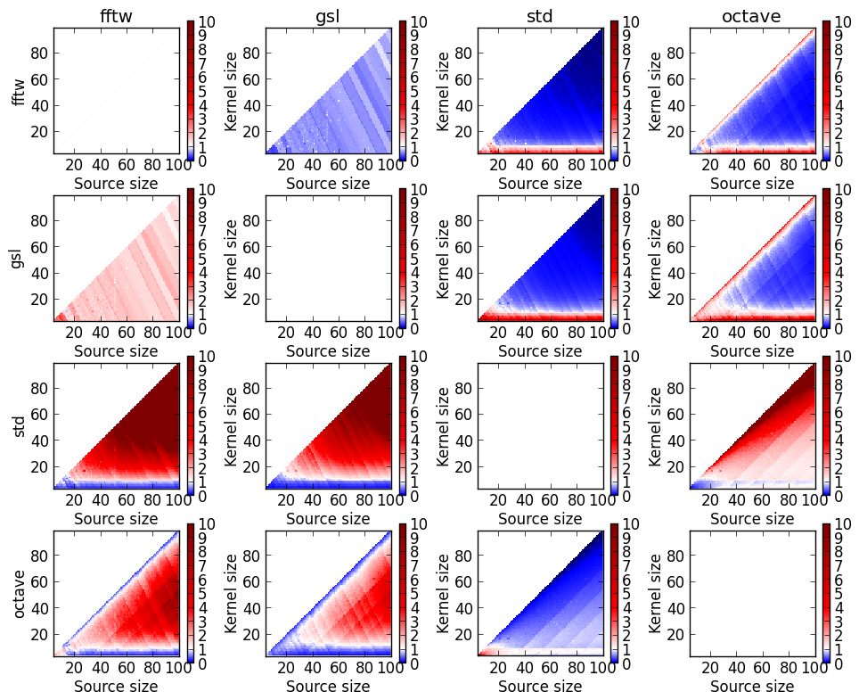
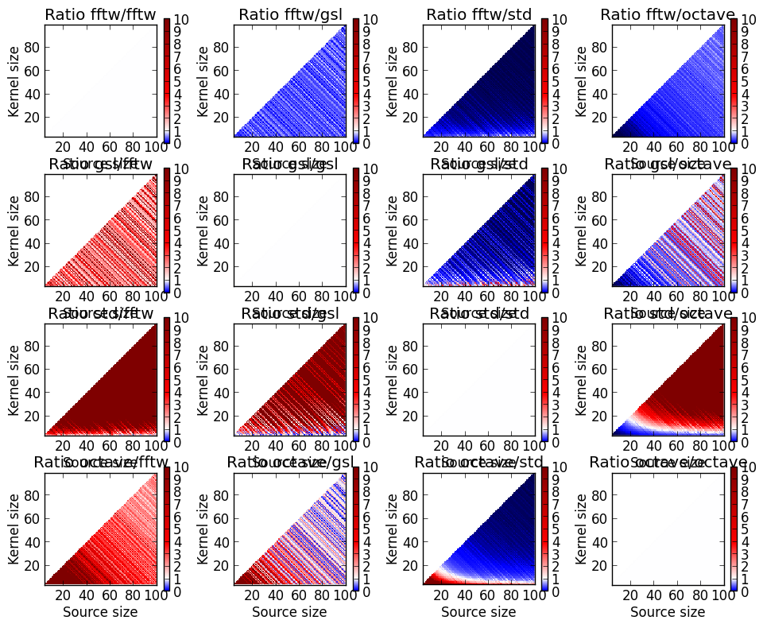

FFTConvolution
==============

Work in progress :

I'm currently rewriting some of the codes to ease running the benchmarks and using the library.

Some C++ codes for computing a 1D and 2D convolution product using the FFT implemented with the GSL or FFTW

The scripts provide some examples for computing various convolutions
products (Full, Valid, Same, Circular ) of 2D real signals. Some
scripts allow you to test the implementation, others (available soon)
are used to benchmark different implementations, using :
- nested for loops
- [GSL](http://www.gnu.org/software/gsl/)
- [FFTW](http://www.fftw.org/)

One of the tricks I use with FFTW is to compute, when possible, an
optimal size of the signals to convolve. As the FFT of FFTW relies on
a prime factor decomposition, it is faster to compute a FFT of a
signal with a size that can be decomposed than of a large prime
size. For some convolutions, you can pad with an arbitrary (lower
bounded) number of zeros. The trick is just to add some more 0's to
get a size that can be decomposed.

A description of the convolution products with the FFT is given in the file [FFTConvolution.pdf](FFTConvolution.pdf).

The provided scripts are :

- fft_gsl.cc : Script for benchmarking the computation of a 2D FFT of a real signal with GSL
- fft_fftw.cc : Script for benchmarking the computation of a 2D FFT of a real signal with FFTW
- convolution_fftw.cc : Script for comparing the convolution products computed with the FFTW with a convolution in Matlab
- convolution_std.cc : Script for comparing the convolution products using nested for loops with a convolution in Matlab

Compilation/Usage
-----------------

Each of the script has a line at the beginning giving the compilation line. 

Results
-------

TODO: give an order of the speedup

Below we plot the comparison of the execution times for performing a linear convolution (the result being of the same size than the source) with various libraries.

All these plots show ratio of execution times with a ratio of 1.0 in white. Overall, it is clear that using the FFTW (first line of the plots) library is faster than nested for loops or Octave as soon as the kernel is at least, say, 10 x 10. Overwise, it is better to use nested for loops.

The illustration below is for circular convolution (full, i.e. with a result of size (size source) + (size kernel) - 1). Here, it is clear that using the FFTW is much faster, whatever the kernel size.

